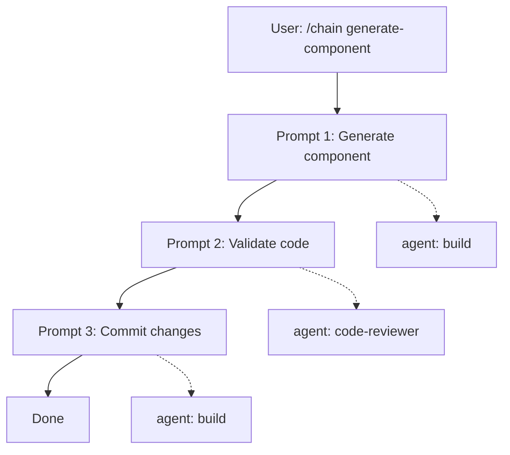

# opencode-chain-prompt

Run multi-step AI workflows in [OpenCode](https://opencode.ai) — fully automated, sequentially chained, with per-step agent control.



Instead of asking the AI to do everything at once (which often produces mediocre results), break it down into focused steps — each with its own agent, model, system prompt, and permissions.

Execute the entire pipeline in one command. Repeat it 22 times with a single `loop` setting.

---

## Why?

| Problem | Solution |
|---------|----------|
| One-shot prompting ignores validation | Split into generate → validate → commit |
| Code review needs a stricter persona | Assign `code-reviewer` agent with `edit: deny` |
| Repetitive tasks done manually | Set `loop: 22` and walk away |
| Context gets polluted across steps | Each step runs in its own session |

---

## Install

### Via npm

```json
// opencode.json
{
  "plugin": ["opencode-chain-prompt"]
}
```

### Local / development

```bash
git clone https://github.com/ganimalqudhaifi/opencode-chain-prompt.git
cd opencode-chain-prompt
npm install
npm run build
```

Then in your `opencode.json`:

```json
{
  "plugin": ["/absolute/path/to/opencode-chain-prompt/dist/index.js"]
}
```

> **Note:** After adding the plugin, restart opencode for it to take effect. The `/chain` command and `chain_start` / `chain_list` tools become available automatically.

---

## Quick Start

### 1. Define a chain

Create a file at `.opencode/chains/generate-component.md`:

```markdown
---
name: generate-component
description: Generate, validate, and commit a React component
default_agent: build
default_model: anthropic/claude-sonnet-4-6
loop: 1
steps:
  - id: generate
    prompt: |
      Generate a React {input} component with Tailwind CSS.
      Use TypeScript. Create the file in src/components/.

  - id: validate
    agent: code-reviewer
    condition: on_success
    prompt: |
      Review the component for:
      - Best practices and code quality
      - Accessibility (ARIA labels, keyboard navigation)
      - Performance (unnecessary re-renders)
      - TypeScript correctness
      Fix any issues found.

  - id: commit
    condition: on_success
    prompt: |
      Stage and commit the changes.
      Format: "feat(components): add {input} component"
```

> `agent` is optional per step — if omitted, it inherits from `default_agent`. Set `agent` explicitly only when a step needs a different role (like `code-reviewer`).

### 2. Run it

```
/chain generate-component button
```

Or ask the AI naturally:

```
Build a button component using the chain
```

The AI detects the `chain_start` tool and executes it automatically.

---

## Full Chain Format

### Top-level Fields

| Field            | Required | Default                    | Description                                |
|------------------|----------|----------------------------|--------------------------------------------|
| `name`           | yes      | —                          | Chain identifier, lowercase hyphen-separated |
| `description`    | no       | —                          | Human-readable description                 |
| `default_agent`  | no       | `"build"`                  | Agent inherited by steps without explicit `agent` |
| `default_model`  | no       | `anthropic/claude-sonnet-4-6` | Fallback model for the chain              |
| `loop`           | no       | `1`                        | Number of times to repeat the entire chain |

### Step Fields

| Field       | Required | Default      | Description                                       |
|-------------|----------|--------------|---------------------------------------------------|
| `id`        | yes      | —            | Unique step identifier, used as `{id}` in templates |
| `agent`     | no       | `default_agent` → `"build"` | Agent name for this step                      |
| `prompt`    | yes      | —            | Instructions sent to the LLM                      |
| `condition` | no       | `"always"`   | When to execute this step (see branching below)   |

### Agent Resolution

The agent name is resolved with this fallback:

```
step.agent → chain.default_agent → "build"
```

Once resolved, the agent config is loaded from (in order):

1. `opencode.json` — `agent.<name>.model`, `agent.<name>.prompt` (system prompt)
2. `.opencode/agents/<name>.md` — frontmatter + file body = system prompt
3. `~/.config/opencode/agents/<name>.md`

Example agent definition in `opencode.json`:

```json
{
  "agent": {
    "code-reviewer": {
      "mode": "subagent",
      "model": "anthropic/claude-haiku-4-20250514",
      "prompt": "You are a strict code reviewer.",
      "permission": { "edit": "deny", "bash": "deny" }
    }
  }
}
```

### Template Variables

| Variable         | Description                                   |
|------------------|-----------------------------------------------|
| `{input}`        | User input passed to `chain_start`              |
| `{iteration}`    | Current loop iteration (1-based)              |
| `{lastResult}`   | Full text output of the previous step         |
| `{<step-id>}`    | Output of a specific step (e.g. `{generate}`) |

### Branching Conditions

| Condition    | Behavior                                       |
|--------------|------------------------------------------------|
| `"always"`   | Always execute (default)                       |
| `"on_success"` | Only if no errors occurred in earlier steps    |
| `"on_error"` | Only if earlier steps produced errors          |

---

## Patterns

### Single-agent chain (cleanest)

All steps share the same agent — no repetition needed:

```markdown
---
name: refactor-all
default_agent: build
loop: 1
steps:
  - id: refactor
    prompt: Refactor {input} to improve code quality.
  - id: test
    prompt: Run tests and fix any failures.
  - id: commit
    condition: on_success
    prompt: Commit with a conventional message.
---
```

### Multi-agent chain (strict roles)

```markdown
---
name: review-and-merge
default_agent: build
loop: 1
steps:
  - id: implement
    prompt: Implement {input}.
  - id: review
    agent: code-reviewer
    prompt: Review the implementation. Approve or request changes.
  - id: merge
    condition: on_success
    prompt: |
      The code was approved. Merge the changes.
      Previous review: {lastResult}
---
```

### Bulk generation (loop)

Generate 22 components automatically:

```markdown
---
name: bulk-generate
default_agent: build
loop: 22
steps:
  - id: generate
    prompt: |
      Generate a React {input} component.
      Iteration {iteration} of {loop}.
      Create the file at src/components/.
  - id: commit
    condition: on_success
    prompt: Commit with message "feat: add {input} component (iter {iteration})".
---
```

---

## Available Tools & Commands

| Interface  | Name           | Description                                     |
|------------|----------------|-------------------------------------------------|
| Command    | `/chain`       | User-facing command — delegates to `chain_start`  |
| Tool       | `chain_start`  | Execute a chain by name with input               |
| Tool       | `chain_list`   | List all available chain definitions             |

The AI calls `chain_start` and `chain_list` automatically; you only need to describe what you want.

---

## Related

- [chain-generator skill](.opencode/skills/chain-generator/SKILL.md) — Ask the AI to create a chain definition for you
- [Example chains](examples/chains/) — Ready-to-use chain files

---

## License

MIT
